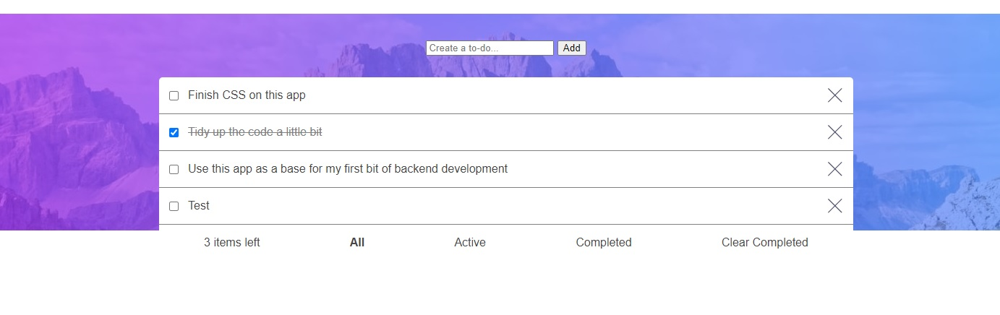

# Frontend Mentor - Todo app solution

This is a solution to the [Todo app challenge on Frontend Mentor](https://www.frontendmentor.io/challenges/todo-app-Su1_KokOW). Frontend Mentor challenges help you improve your coding skills by building realistic projects. 

## Table of contents

- [Overview](#overview)
  - [The challenge](#the-challenge)
  - [Screenshot](#screenshot)
  - [Links](#links)
- [My process](#my-process)
  - [Built with](#built-with)
  - [What I learned](#what-i-learned)
  - [Continued development](#continued-development)
  - [Useful resources](#useful-resources)
- [Author](#author)
- [Acknowledgments](#acknowledgments)

**Note: Delete this note and update the table of contents based on what sections you keep.**

## Overview

### The challenge

Users should be able to:

- View the optimal layout for the app depending on their device's screen size (__incomplete__)
- See hover states for all interactive elements on the page (__incomplete__)
- Add new todos to the list (__complete__)
- Mark todos as complete (__complete__)
- Delete todos from the list (__complete__)
- Filter by all/active/complete todos (__complete__)
- Clear all completed todos (__complete__)
- Toggle light and dark mode (__incomplete__)
- **Bonus**: Drag and drop to reorder items on the list (__complete, but needs optimisation__)

### Screenshot




### Links

- Solution URL: [https://github.com/willgarrett64/todo-app/](https://github.com/willgarrett64/todo-app/)
- Live Site URL: [https://willgarrett64.github.io/todo-app/](https://willgarrett64.github.io/todo-app/)

## My process

### Built with

- Semantic HTML5 markup
- CSS custom properties
- Flexbox
- CSS Grid
- Vanilla JavaScript
- Mobile-first workflow


### What I learned

I have worked on a number of Frontend Mentor challenges, and have fallen into the habit of defaulting to React due to its wide-scale use and elegance. However, I decided to take on this challenge with purely vanilla JavaScript.

I compare it to learning how to drive an automatic car (React) but forgetting how to drive a manual (Vanilla JS). I am pleased with my result, however there are some areas that would be inefficient if you were to scale the app up (see my `render()` function below). 

Initially, every time I added or deleted a to-do, I was first updating my array of to-dos (`toDoList`) and also updating the DOM with two separate functions. I wanted a way to automatically re-render everytime `toDoList` was updated, similar to how React re-renders when state is updated. 

My solution was to create this `render()` function that is called every time I add or delete any to-dos in `toDoList`, but also when I toggle between view all / view completed / view active. 

The way it works is to first delete all DOM elements in the to-do list and then re-render them. If I were to have a large number of items, it would be inefficient to delete them all just to re-render them rather than simply adding/deleting the one in question. That being said, I am satisfied with this solution for now. 

```js
// render all to-dos from the toDoList array
const render = () => {
  // remove all elements currently in the to-do list <div>
  while (toDoListElement.lastChild) {
    toDoListElement.lastChild.remove();
  }

  // create an array of elements to display (based on view all, active or completed)
  let toDisplay = [];
  switch (view) {
    case 'all':
      toDisplay = toDoList;
      break;
    case 'active':
      toDisplay = toDoList.filter(el => el.active);
      break;
    case 'completed':
      toDisplay = toDoList.filter(el => !el.active);
      break;
  }

  //re-set container ID to 1. This will increment for each to-ado added
  containerId = 1; 
  // render toDisplay into the to-do list <div>
  toDisplay.forEach(toDo => {
    addToDoToDom(createToDoEl(toDo), containerId)
    containerId++;
  })
  
  // update the tasks-left element, counting all "active" to-dos
  let tasksLeft = 0;
  toDoList.forEach(el => {
    if (el.active) {
      tasksLeft += 1;
    }
  })
  tasksLeftEl.innerHTML = `${tasksLeft} items left`;
}
```


### Continued development

As it stands, this to-do app is incomplete. The areas I aim to improve/finish are:
- Finish CSS, including making the page responsive across all screen sizes.
- Optimise drag and drop: at the moment you can switch one to-do with another, however it would be more ideal to drop an to-do and for the whole list to re-order.
- Add back-end technology.

This project has lead me to start work on a kanban style to-do app. More to follow. 

### Useful resources

- [Example resource 1](https://www.example.com) - This helped me for XYZ reason. I really liked this pattern and will use it going forward.
- [Example resource 2](https://www.example.com) - This is an amazing article which helped me finally understand XYZ. I'd recommend it to anyone still learning this concept.

**Note: Delete this note and replace the list above with resources that helped you during the challenge. These could come in handy for anyone viewing your solution or for yourself when you look back on this project in the future.**

## Author

William Garrett
- GitHub - [https://github.com/willgarrett64](https://github.com/willgarrett64)
- LinkedIn - [https://www.linkedin.com/in/william-garrett-4a06ba1b7/](https://www.linkedin.com/in/william-garrett-4a06ba1b7/)


## Acknowledgments

I'd like to thank [Richard Convery](https://github.com/richardconvery) for running the [MK Codecademy Chapter](https://community.codecademy.com/milton-keynes/) and bringing these project challenges to my attention. The chapter has been great as a way to develop my skills, meet other developers and keep motivation high. 